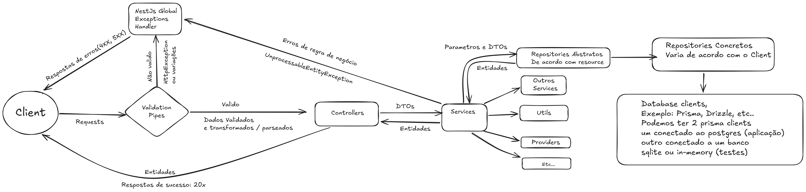
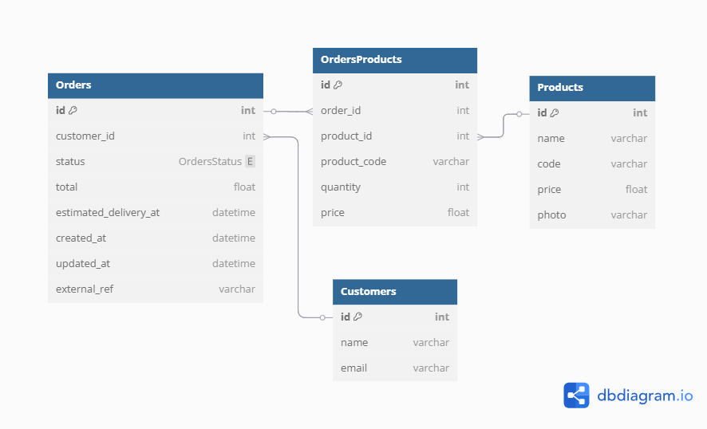

# Hermes Agoraios

Batizei o projeto com nome de um epíteto de Hermes Deus do Comércio, que é "Hermes Agoraios",
culto no qual Hermes é adorado como defensor de Ágora , uma praça pública e centro do comércio na Grécia Antiga.

Projeto de software para loja virtual com serviços avançados de criação de pedidos e de obtenção refinada de dados de produto.
## Diferencias do meu teste
- Documentação totalmente automatizada e lastreada ao código para facilitar a vida de todo time, qas, testers, etc...
- Sistema de validação robusto e eficiente que só permite que requisições validas alcancem a camada de controllers
- Baixo consumo de memória graças a injeção e inversão de dependência, maior parte dos providers e services singleton
- Sistema de importação de pedidos por CSV a prova de falhas, resiliente, e com erros auto explicativos
- Serviço de produtos moderno e performatico utilizando Server Side Events, com limitador de consumo das APIs externas, retorno imediato dos dados pre-existentes
 - ***Obs.: Não consegui testar a versão final do serviço de produtos pois fiz algumas refatorações depois que meu token já havia expirado e essas ficaram sem que eu conseguisse testa-las, se tiver algum erro me perdoem, me fornecendo um novo token resolvo rapidinho, mais fiz de uma forma que em caso de erro irá funcionar o streaming de produtos porém não conseguirá preencher as informações adicionais apenas.***
- Cacheamento dos dados retornados pelas apis de terceiros (Configurado com expiração automatica em 5 minutos)
- Além dos endpoints previstos pelo teste, também criei endpoints para criação de consumidores e recuperação de lista de consumidores
- Criei um gerador de produtos que pode ser usado para gerar qualquer quantidade de produtos através do comando ```npm run generate:products ARG``` onde arg é o número de produtos desejado
- Criei um sistema de feed de produtos com base no arquivo gerado
- Código limpo, arquitetura bem definida, seguindo principalmente o principio da responsabilidade única, keep it super simple (KISS), e dont repeat yourself (DRY)
- **Sobre não ter feito com Javascript Nativo** - Apesar de ter utilizado um framework para o desafio, acredito na importância do conhecimento profundo em Javascript nativo, me proponho a uma sessão de live coding, ou desafios nas plataformas de testes assistidos (hackerrank, coderbyte, leetcode) para resolução de problemas complexos em javascript nativo caso seja necessário para comprovar meu conhecimento nesta área.

## Tecnologias utilizadas
- **NestJS** Framework principal, escolhi este framework por estar estudando ele atualmente, esta crescendo muito e demonstrando bons resultados e sendo adotado por grandes empresas, e está entre os mais modernos também, 
- **Adapter NestJS Express** NestJS permite ajustar o adapter que irá rodar em baixo do capo entre Express e Fastfy, por ser um projeto pequeno sem requisitos de alta performance, não alternei o adapter para o adapter do Fastfy, mantive o padrão Express
- **NestJS Swagger** Plugin para criação de documentação automática
    - Ao rodar o projeto basta acessar sua base url + /docs ex.: (http://localhost:3000/docs) para visualização da documentação ricamente detalhada utilizando todo potencial e automação do plugin graças ao mecanismo de introspectComments oferecido
- **Class-Validator e Class-Transform** - Apesar da minha experiência com Yup e Zod, decidi adotar o class-validator por considerar que ele combina melhor com o ecosistema do NestJs além de trazer mais facilidades e possuir maior suporte pelo framework
- **PrismaORM** - Banco configurado para rodar na engine SQLite (banco em arquivo local). Confesso não ser um grande fã do Prisma devido ao seu querybuilder gerar queries não muito otimizadas e me sentir "travado" as vezes pelo seu querybuilder.
- **Cache-Manager** - Pacote de cacheamento que oferece a opção de configurar diversos adapters como por exemplo o Redis para cacheamento. Usei o padrão que roda em cima do Keyv (https://keyv.org/docs/)
- **rxjs** - Utilizado para lidar com os Observables retornados pelo HttpClient e também para lidar com os Subjects do Server Sent Events

## Arquitetura

- Como escolhi utilizar um framework no lugar de realizar o teste utilizando Javascript nativo, tentei utilizar o arsenal que já estava sendo disponibilizado pelo NestJS. Usei bastante a inversão de dependencia e injeção de dependência oferecida para conseguir aproveitar ao maximo das caracteristicas Singleton do framework, desenvolvi uma arquitetura de repositorios onde apenas 1 instancia do serviço de banco de dados fosse compartilhada entre todos repositorios, e os repositorios especificos de um recurso fossem compartilhados entre todos services que necessitassem daquele repositorio.
- **Validações** - Abusei das validações do class-validator, para que apenas chegasse em meus controladores dados confiáveis e com minimo possível de possibilidade de inpedimentos para processar a requisição, criando também decorators customizados:
    - @IsEmailAvailable() - Verifica se o valor do campo marcado com este decorator é um email esta disponível para cadastro de um consumidor (ainda não usado)
    - @IsValidCustomerId() - Verifica se o valor do campo marcado com este decorator representa um id de consumidor valido
    - @IsValidProductCode() - Verifica se o valor do campo marcado com este decorator representa um codigo de produto valido
- **Tratamento de erros** - Abusei dos Exception Filters do NestJS e de seu global http error handler. No lugar de declarar vários blocos try catch aninhados e lidar com tudo manualmente, aproveitei o poder do framework de reconhecer as proprias exceções prontas oferecidas por ele e automaticamente montar a resposta adequada para o cliente.
- **Regras de negócio** - Para as logicas de programação mais especificas do caso de uso (service) implementei validações na camada de serviço que ficou responsavel por toda "inteligencia" de negócio da aplicação.

### Camadas

- O design da arquitetura segue muito o recomendado pelo NestJS então ficou:

Client
-> Requests
-> Guards (Utilizei apenas 1 guard que é o AuthGuard para autenticação)
-> Validations Layer (Pipes, Class-Validator)
-> Controllers enviar Dtos para os services
-> Services aplicam as regras de negócio e enviam dtos para os repositorios ou para outros services
-> Repositorios devolvem entidades para o service
-> Services retornam as entidades para os Controllers
-> Controllers retornam as respostas dos requests para o Client
-> Global: A qualquer momento, uma camada que encontrar uma impossibilidade de continuar o processamento pode lançar uma exception do NestJS para interromper o processamento antecipadamente.

Fiz um Diagrama esboçando este resumo:


Link para visualização online:
[Diagrama da arquitetura](https://excalidraw.com/#json=bFZ_SFM-haLpBYhE-chwK,o18803fSmVsqV7eqqo8F3g)

### Modelagem de dados

De acordo com os requisitos do projeto, modelei a seguinte base de dados:

Optei por um banco com apenas 3 tabelas principais e 2 relacionamentos: Produtores, Propriedades Rurais, Culturas.

Cheguei a pensar em criar uma tabela exclusivamente para as safras, mais o ganho de reaproveitamento de dados seria pequeno em relação ao aumento da complexidade que isso traria para filtragem e aplicação das regras de negócio, mapeamento de entidades no codigo, dtos, aumento de 1 crud para cadastramento de safras ou criação de um seed para alimentar a tabela com valores padrão, etc.. então tornei a safra apenas uma propriedade das culturas, tentei ser um pouco KISS neste ponto (Keep It Super Simple)

Portanto o modelo final do banco ficou assim:



Link para visualização online:
[Diagrama de Dados](https://dbdiagram.io/d/683ffdbe61dc3bf08d85a719)


## Instalação & Execução

1 - Clone o projeto:

```
git clone https://github.com/thereAreDevelopersInBrazil/HermesAgoraios.git
```

2 - Entre no diretório do projeto clonado e Instale as dependências utilizando um gerenciador de pacotes de sua preferencia (npm ou yarm ou pnpm)
```
npm install
```
3 - Renomeie o arquivo ```.env-sample``` para ```.env```

4 - Para rodar em modo produção execute:
```
npm run build
```
e em seguida:
```
npm run start:prod
```

5 - Para rodar em modo desenvolvimento é necessário apenas:
```
npm run start:dev
```

6 - Pronto, em ambos casos (produção ou desenvolvimento) sua aplicação estará rodando e aguardando requisições na URL:
```
http://localhost:3000/
```

6 - Para acessar a documentação da API (Swagger) acesse:
```
http://localhost:3000/docs
```

7 - Também criei um gerador de produtos que gera um arquivo products.json na pasta ```prisma\products.json```, para rodar o gerador de produtos execute:

```
npm run generate:products ARG
```
Onde ARG é a quantidade de produtos desejada ex.: 10000

Para acessar a documentação da API (Swagger) acesse:
```
http://localhost:3000/docs
```

Para facilitar, criei uma collection no Postman e compartilhei com email de vocês, mais em todo caso segue o link para a collection do postman:
```
https://app.getpostman.com/join-team?invite_code=19c03856ed703f28e99738d08bc7d478e5be353419801cf1abd099c643d24fec
```
